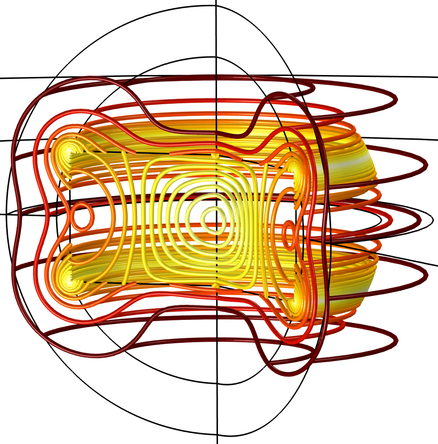

# Characteristic Modes Via Transition Matrix

A characteristic electric field magnitude at the fourth resonance of a dielectric cylinder (relative permittivity 38, height 4.6 mm, radius 5.25 mm) as evaluated by FEM solver of Comsol Multiphysics.

# Table of Contents
- [Overview](#overview)
- [Characteristic Modes Using FEM and Comsol Multiphysics](#characteristic-modes-using-FEM-and-comsol-multiphysics)
- [References](#references)

# Overview
References [1, 2] shows, how characteristic mode data (characteristic values, characteristic fields and other related quantities) can efficiently be obtained using transition matrix. An essential property of this framework is that characteristic modes can be obtained using any electromagnetic solver that is able to resolve a dynamic scattering scenario. As an example, and as an supplement to references [1, 2], this repository includes wrappers and post-processing routines for calculating characteristic modes using Finite Element Method of Comsol Multiphysics. These codes are posted as supplemental material to [1, 2] ( #references) and you can cite these references to reference this repository.

## Contact information
Questions and suggestions related these codes can be addressed to Lukas Jelinek, Czech Technical University in Prague, lukas.jelinek[at]fel.cvut.cz.

## Disclaimer
Although documented and tested, these codes are intended as demonstrations of the procedures described in [1, 2] (#references) and are not written as general-purpose tools. Feel free to experiment and modify these codes, but at your own risk.

# Characteristic Modes Using FEM and Comsol Multiphysics
The electromagnetic model is supposed to be build in Comsol environment. The evaluation of transition matrix is then performed in MATLAB using MATLAB LiveLink feature in Comsol and using scattering formulation in the RF module. The scripts assume the use of excitation defined using MATLAB function. To enable this feature, the use of MATLAB functions must be enabled in “Comsol --> Preferences --> Security: Allow external libraries, Allow external Matlab functions”. Post-processing steps are performed in MATLAB. The scripts were tested in Comsol 6.0 and MATLAB 2020a. Paths “COMSOL60\Multiphysics\mli”, “FEM_Comsol” and their subdirectories must be in Matlab paths.

## Generic Workflow
It is assumed that electromagnetic model is already build (“*.mph” file is available) including the MATLAB-based excitation in the RF module and that scattering formulation is used. The transition matrix is obtained using repetitive excitation of the structure via spherical vector waves. Assuming a dielectric body, the excitation is provided by an external current density and Matlab function “JiSW.m” for full 3D simulation or “JiSWaxisym.m” for axi-symmetric problems (body of revolution). These functions must be introduced in the Comsol environment under the "Global definitions --> MATLAB", see the example for more details. It is important to notice that both these functions use function “epsrMap.m” that defines the dielectric composition of the scatterer. A simple dielectric sphere (“dielSphereSWMatlabJiAxisym.mph”, “dielSphereSWMatlabJi.mph”) and simple dielectric cylinder (“dielCylinderHuWangSWMatlabJiAxisym.mph”) are prepared in the current state. 

Prior to running the main script for 3D problems (“No02_getTmatComsolJiReRe.m”) or the main script for Axi-symmetric problems (“No02_getTmatComsolJiAxisymCpxCpx.m”), the link between Matlab and Comsol must be opened using “No00_startComsolServer.m, No01_connectComsol.m”. This turns on the Comsol server and initializes the LiveLink connection.

The evaluation of transition matrix is based on repetitive call of a loop in which the excitation is chosen by parameter “SWindex” and the scattered electric field “Es” is evaluated. In each loop, the scattered field is sampled and projected on spherical vector waves using function “projectEsTofAxisym.m” for axi-symmetric problems or “projectEsTof.m” for general 3D problem. Each iteration produces one column of transition matrix. Subsequent steps are the eigenvalue decomposition and mode tracking which are performed by script "No03_getCMdata.m". Tracked modal data can be plotted using "No04_plotTrackedResults.m"

## Body of Revolution Example

## General 3D Example

## Converters
The folder "FEM_Comsol" in its name space "+utilities" also contains several convertor tools transforming scattering dyadic to transition matrix ("getTfromSdyad.m") and vice versa ("getSdyadFromT.m") or transforming far fields into spherical vector wave expansion ("getFSWfromF.m") and vice versa ("getFfromFSW.m").

# References
[1] M. Gustafsson, L. Jelinek, K. Schab, M. Capek,  "Unified Theory of Characteristic Modes: Part I -- Fundamentals", IEEE Transaction on Antennas and Propagation (submitted), arxiv: [2109.00063](https://arxiv.org/abs/2109.00063)

[2] M. Gustafsson, L. Jelinek, K. Schab, M. Capek, "Unified Theory of Characteristic Modes: Part II -- Tracking, Losses, and FEM Evaluation", IEEE Transaction on Antennas and Propagation (submitted), arxiv: [2110.02106](https://arxiv.org/abs/2110.02106)
